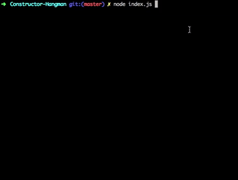

# Constructor-Hangman
This application is a Node.js-driven command line trivia game.



## Technologies Used
This simple Node.js application uses the [Inquirer](https://www.npmjs.com/package/inquirer "Inquirer")  npm package to prompt the user to input letters, and provides feedback about the user's progress.

### Downloading This Application
To use this application:

1. Ensure that Node.js and npm are installed on your machine. For instructions, see the Technologies Used section below.
- Next, clone this repo to your local machine:
```
git clone git@github.com:stoversa/Constructor-Hangman.git
```
2. Open the repo and execute the following in the bash terminal. Doing so should install the required NPM packages:
```
npm i
```
### Gameplay
The game is played entirely through the terminal. Simply type the following to begin:
```
node index.js
```
Enjoy!